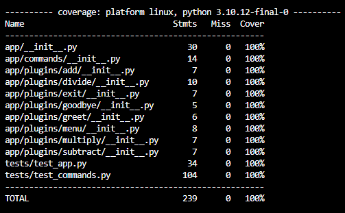
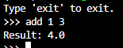

# Homework 5

## Introduction
Interactive command-line application (Calculator) that operates continuously, transitioning from a single-execution script to a fully functional application. Explored command pattern, REPL and dynamically load commands using a simple plugin architecture. Understood the appropriate use of exceptions versus conditional statements to manage invalid data inputs.

## Enhancements
Following enhancements are made to the previous version. 

1. Integrated the command pattern and REPL principles to the existing system and added four basic commands: add, subtract, multiply, and divide, making the calculator interactive.

2. Created a menu command, which lists out the available commands the user can use.

3. Implemented plugin architecture, the code would dynamically load the command without hard-coding thereby elemenating the violation of Open-Close principle.

4. Updated the test cases after extending the functionalities (including plugin architecture) and achieved 100% test coverage.

## Command Instructions

Use menu command to get the lsit of commands

Arthemetic operations: operation num1 num2

To use a new command, add the new command folder (should include __init__.py) in the plugins folder.

## Setup Instructions
1. Clone the repo
2. CD into the project folder
3. Create the virtual environment 
4. Activate the virtual environment (VE)
5. Install Requirements

## Test Commands
1. pytest run all tests
2. pytest tests/test_main.py <- Run just the tests in this file
3. pytest --pylint --cov <- Run Pylint and Coverage (Can be run independently)

## Current Libraries Installed
1. [Pytest - Testing Framework](https://docs.pytest.org/en/8.0.x/)
2. [Faker - Fake Data Creation](https://faker.readthedocs.io/en/master/)
3. [Pytest Coverage](https://pytest-cov.readthedocs.io/en/latest/readme.html)
4. [Pytest Pylint](https://pylint.readthedocs.io/en/stable/development_guide/contributor_guide/tests/launching_test.html)
## Adding Library
1.  Make sure you are in the correct VE, if not sure run "deactivate"
2.  Activate the VE
3.  Run pip freeze > requirements.txt